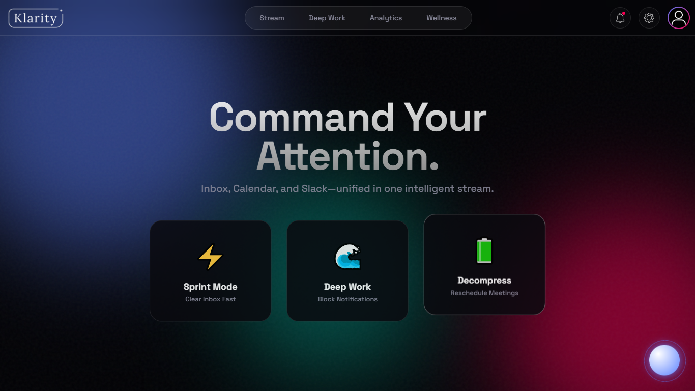
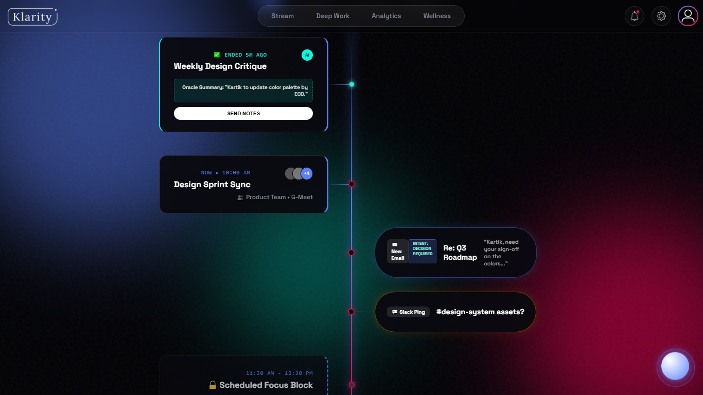
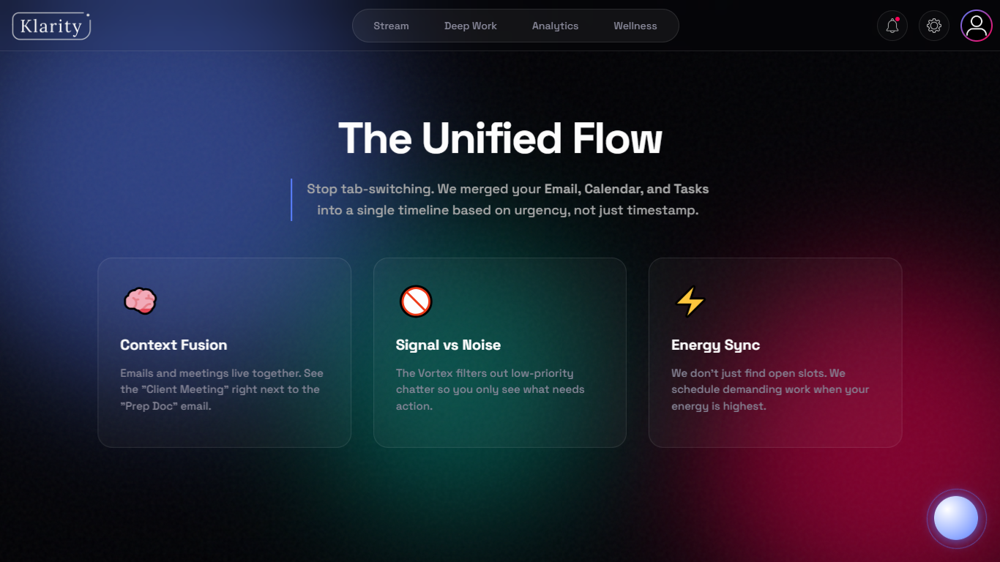
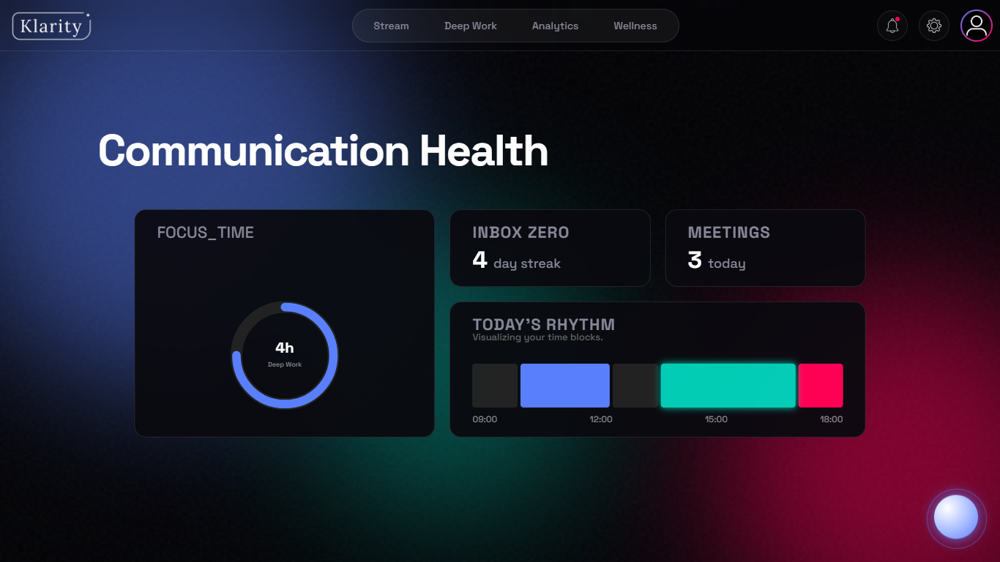
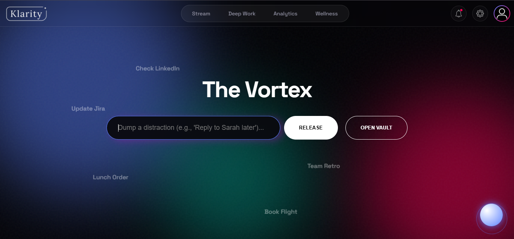

# Klarity | The Operating System for Attention 

<div align="center">
  <h1>Inbox, Reimagined.</h1>
  <p>
    <b>Klarity</b> is a unified workspace designed to eliminate context switching, 
    manage energy, and restore flow for modern teams.
  </p>
</div>

---

## 🚨 The Problem: Context Switching Fatigue
Modern work is fragmented. A typical user (like our persona, **Kartik**, a Design Intern) constantly toggles between:
1.  **Gmail** for communication.
2.  **Google Calendar** for time management.
3.  **Slack** for team coordination.
4.  **ToDo Lists** for tasks.

**The Result:** Anxiety, missed deadlines, and a complete lack of "Deep Work." Existing tools are just static lists of demands that ignore human energy levels.

## 💡 The Solution: Klarity
Klarity is not just another inbox. It is a **Flow-First Operating System** that unifies Email, Calendar, and Chat into a single, intelligent "River of Time."

Instead of forcing you to check 5 apps, Klarity brings the context to you based on **Urgency**, **Intent**, and **Energy**.

---

## ✨ Key Features

### 1. The Unified Stream (River) 🌊
* **Context Fusion:** Emails, Meetings, and Slack pings appear in one vertical timeline.
* **Intent Recognition:** Emails are tagged automatically (e.g., *"Intent: Decision Required"*), so you know *why* you are reading them.
* **Context Switcher:** Toggle between **"Startup Mode"** and **"University Mode"** to keep work and life separate.
* **Shared Context:** Team avatars show exactly who is involved in a task.

### 2. The Vortex (Cognitive Offloading) 🌪️
* **Dump Distractions:** Have a random thought? ("Book flight", "Call Mom"). Don't open a new tab.
* **Release & Forget:** Throw it into the Vortex. It visually sucks the thought away, saving it for later so you can stay in flow.

### 3. Oracle Copilot (AI) 🤖
* **Executive Assistant:** Summarizes long email threads and meeting notes.
* **Auto-Scheduling:** "Book a meeting" directly from an email card.
* **Intern-Specific Context:** Helps draft replies to clients and manage Jira tickets.

### 4. Deep Work Protocol 🔒
* **Tunnel Vision UI:** When you click a task, the interface locks down.
* **Ignition Steps:** Breaks big tasks into micro-steps to cure procrastination.
* **Focus Timer:** Built-in Pomodoro/Deep Work sessions.

### 5. Wellness & Gamification 🔋
* **Energy Sync:** Select your energy level (High/Flow/Low) to adjust the interface.
* **Balance Points:** Earn points for clearing the stream and redeem them for "Wellness" rewards (e.g., Donation to Charity, White Noise packs).

---

## 🛠️ Technology Stack
* **Frontend:** HTML5, CSS3 (Custom Glassmorphism & Aurora Gradients)
* **Interactivity:** Vanilla JavaScript (ES6+)
* **Animations:** CSS Keyframes & IntersectionObserver API (for the Scroll-Linked Stream)
* **Persistence:** LocalStorage (to save User State & Points)

---

## 📸 Screenshots

| **Dashboard** | **Stream Timeline** | **Features** |
|:---:|:---:|:---:|
|  |  |  |
| **Insights** | **Vortex (Distraction List)** |
|  |  |

---

## 🚀 Live Demo
**[🌐 Click Here to Try Klarity Live](https://klarity-six.vercel.app/)**
*(Deployed at Vercel)*

---

## 🚀 How to Run the Project
This project is built with pure web technologies. No complex backend installation is required.

1.  **Clone the Repository**
    ```bash
    git clone [https://github.com/mihirkamat03/klarity.git](https://github.com/mihirkamat03/klarity.git)
    ```
2.  **The Flow**
    * **Home:** Experience the feature walkthrough.
    * **Login:** Click "Launch Workspace" -> "Enter Klarity".
    * **Dashboard:** Explore the Unified Stream.

---

<div align="center">
  <b>Built with ❤️ by Team MIT</b>
</div>
